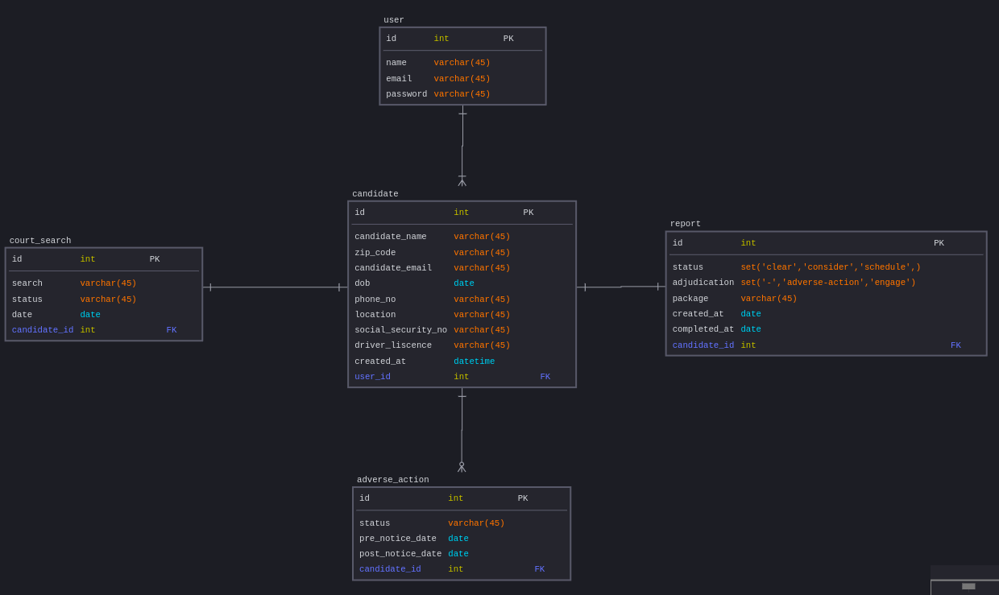

# Problem_Statement
Sara is a recruiter at zeus corps. She is trying to hire candidates from applicants for SDE role but due to large no of applicants it is really hard to do background checks for each of them because the team can't find all the information at one place and it takes lots of time to complete the task. So they need a tool to perform the activity.

## Loom video recording of Checkr Application
https://www.loom.com/share/e04f3e66ac344dcd8666fe477857f4b2

## Checkr Application Prototype
https://www.figma.com/proto/YnrJYr7uKzClRLBgfEwTg5/Checkr-Golden-Path-(Bootcamp)?type=design&node-id=1117-12942&t=8wnPwbEjeaxVLgt6-0&scaling=min-zoom&page-id=904%3A2483&starting-point-node-id=1117%3A12942

## DB Design

## API swagger documentation
https://app.swaggerhub.com/apis/ABHISHEKBANDAMEEDI/Abhishek/1.0.0#/